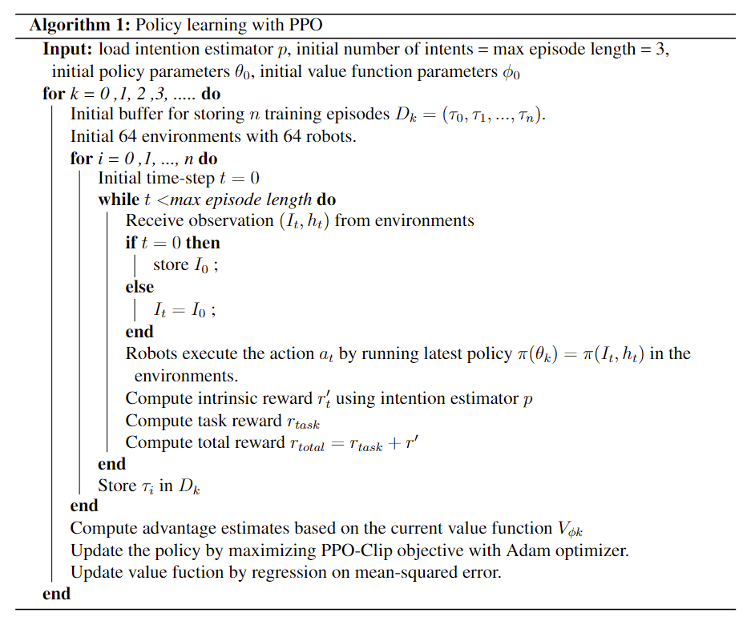
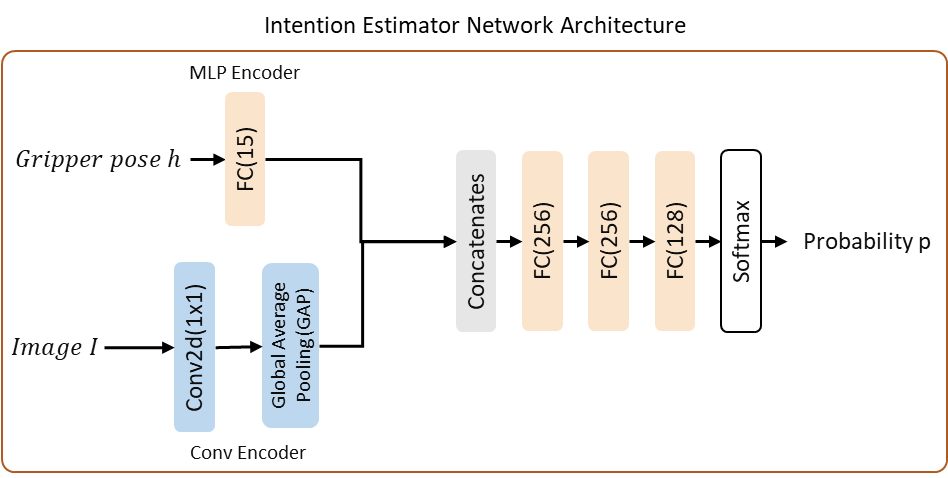
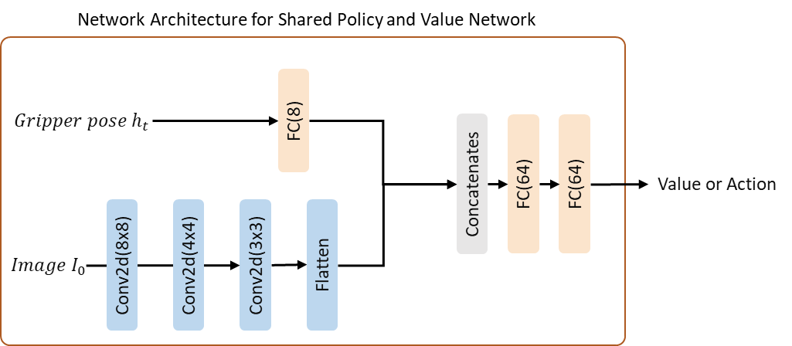

## Learn from Intents: Learn to Grasp via Intention Discovery and its Application to Challenging Clutter

___
### Video
**Picking in cluttered conveyor and cluttered table**

 
 

### Algorithm Outlines of Policy Learning

 

### Network Architecture
**Intention Estimator Network Architecture**

 

**Network Architecture for Shared Policy and Value Network**

 

### Code and Extras

You can view the code [here](https://github.com/chao0716/LearnfromIntents).

### Paper

  
